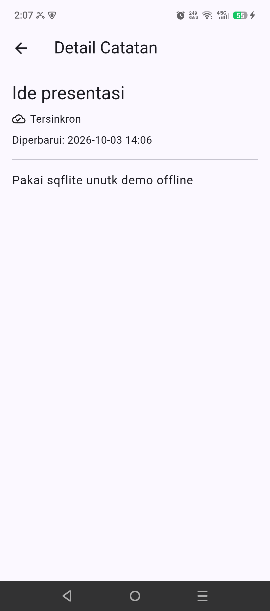
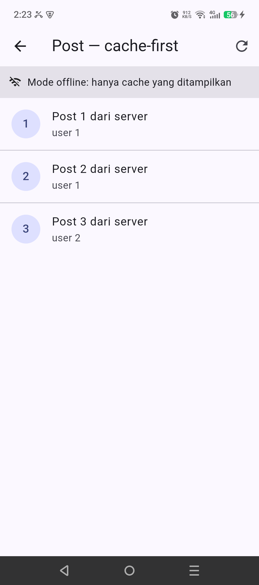

# Minggu 5 — Local Storage & Offline First

Laporan praktikum codelab Flutter JTI Polinema, minggu 5.

Project: `week5_offline_notes/` — Flutter + Riverpod 3 + `sqflite` +
`shared_preferences` + `go_router`.

Referensi codelab:
<https://jti-polinema.github.io/flutter-codelab/05-minggu-5-local-storage-offline-first/index.html>

---

## Ringkasan hasil

| Aspek | Status |
|---|---|
| Preferensi bertahan (SharedPreferences) | Selesai — tema gelap + "terakhir dibuka" |
| Catatan bertahan (SQLite sqflite) | Selesai — 2 tabel, version 1 |
| Antrean sinkronisasi (`dirty` flag) | Selesai — badge + tombol Sinkron |
| Cache-first read (post) | Selesai — cache dulu, refresh background |
| Mode offline | Selesai — toggle simulasi + banner |
| Repository sebagai satu-satunya pintu | Selesai — UI tidak menyentuh SQLite/Prefs |
| `flutter analyze` | Bersih (No issues found) |
| `flutter test` | 17/17 lulus |
| Screenshot dari device HP asli | 10 file |
| `docs/ai-challenge.md` | Selesai |

---

## 1. Tujuan pembelajaran

1. Menyimpan data lokal dengan `shared_preferences` dan `sqflite`.
2. Menerapkan pola **offline-first**: data tetap berguna tanpa jaringan.
3. Memisahkan akses data lewat **repository**, bukan dari widget.
4. Membersihkan utang teknis lewat refactoring + test.

## 2. Konsep

Tiga mekanisme offline-first yang dipakai:

1. **Cache-first read** — baca cache lokal dulu, tampilkan langsung, lalu
   refresh dari jaringan di background. Hasil refresh menimpa cache.
2. **Dirty flag** — tiap catatan punya kolom `dirty`. Ditulis `1` saat
   ditambah/diubah, `0` setelah sukses disinkronkan.
3. **Antrean sinkronisasi last-write-wins** — urut `updated_at`; pada project
   nyata, catatan dengan `updated_at` lebih baru menang.

Aturan keras: **repository adalah satu-satunya pintu data**. Widget tidak boleh
memanggil `SharedPreferences.getInstance()` atau `Database` langsung.

| Kebutuhan | Pilihan | Alasan |
|---|---|---|
| Preferensi (1 nilai bool / string) | SharedPreferences | Key-value, tanpa query, baca < 1 ms |
| Catatan (1000+ baris, CRUD + antrean sync) | sqflite | `ORDER BY updated_at`, `WHERE dirty = 1`, `COUNT(*)` jadi SQL; ada transaksi |

## 3. Struktur project

```
05-week-5-local-storage-offline-first/          # root minggu 5 (laporan + kode)
├── README.md                                 # laporan ini
├── lib/                                      # kode aplikasi (salinan dari project)
│   ├── main.dart                             # ProviderScope + MaterialApp.router + tema
│   ├── data/
│   │   ├── prefs.dart                        # PrefsRepository (SharedPreferences)
│   │   ├── providers.dart                    # semua provider Riverpod
│   │   ├── sync.dart                         # PostCacheRepository + syncNotes()
│   │   ├── local/
│   │   │   ├── db.dart                       # openNotesDb() — 2 tabel, version 1
│   │   │   ├── note.dart                     # model Note + fromMap/toMap aman
│   │   │   └── post.dart                     # model Post + CachedPost (row mapper)
│   │   └── repositories/
│   │       └── note_repository.dart          # CRUD + countDirty + markAllSynced
│   ├── pages/
│   │   ├── notes_page.dart                   # daftar catatan + form tambah + tombol sync
│   │   ├── note_detail_page.dart             # /note/:id
│   │   ├── posts_page.dart                   # bukti cache-first
│   │   └── settings_page.dart                # toggle tema + toggle simulasi offline
│   ├── router/
│   │   └── app_router.dart                   # GoRouter + AppRoutes terpusat
│   └── widgets/
│       └── note_tile.dart                    # NoteTile + badge "Belum tersinkron"
├── test/
│   ├── note_test.dart                        # 10 test: model, provider, sync
│   └── widget_test.dart                      # 7 test: NoteTile, settings, cache-first
├── docs/
│   └── ai-challenge.md                       # prompt AI + tabel + verifikasi
├── screenshots/
│   ├── 01-daftar-catatan.png
│   ├── 02-tambah-catatan.png
│   ├── 03-form-terisi.png
│   ├── 04-badge-dirty.png
│   ├── 05-sesudah-sync.png
│   ├── 06-detail-catatan.png
│   ├── 07-pengaturan.png
│   ├── 08-pengaturan-offline-aktif.png
│   ├── 09a-posts-online.png
│   └── 09-posts-offline-cache.png
└── week5_offline_notes/                      # project Flutter (flutter create + android/)
```

`lib/` dan `test/` di root adalah salinan kode yang dibahas laporan; project
yang benar-benar di-build dan di-`adb install` ada di `week5_offline_notes/`.

---

## 4. Praktikum 1 — SharedPreferences

`lib/data/prefs.dart` — satu pintu ke key-value. Widget tidak pernah memanggil
`SharedPreferences.getInstance()` sendiri.

```dart
class PrefsRepository {
  static const _darkModeKey = 'dark_mode';
  static const _lastOpenedKey = 'last_opened_at';

  Future<bool> getDarkMode() async {
    final prefs = await SharedPreferences.getInstance();
    return prefs.getBool(_darkModeKey) ?? false;
  }

  Future<void> setDarkMode(bool value) async {
    final prefs = await SharedPreferences.getInstance();
    await prefs.setBool(_darkModeKey, value);
  }

  Future<void> markOpenedNow() async {
    final prefs = await SharedPreferences.getInstance();
    await prefs.setString(_lastOpenedKey, DateTime.now().toIso8601String());
  }

  Future<String?> getLastOpened() async {
    final prefs = await SharedPreferences.getInstance();
    return prefs.getString(_lastOpenedKey);
  }
}
```

State tema lewat `AsyncNotifier` + `AsyncValue.guard` (Riverpod 3):

```dart
final darkModeProvider = AsyncNotifierProvider<DarkModeNotifier, bool>(
  DarkModeNotifier.new,
);

class DarkModeNotifier extends AsyncNotifier<bool> {
  @override
  Future<bool> build() => ref.watch(prefsRepositoryProvider).getDarkMode();

  Future<void> toggle() async {
    final next = !(state.value ?? false);
    state = const AsyncLoading();
    state = await AsyncValue.guard(() async {
      await ref.read(prefsRepositoryProvider).setDarkMode(next);
      return next;
    });
  }
}
```

`lastOpenedProvider` dibuat `autoDispose` supaya "Terakhir dibuka" dibaca ulang
tiap halaman Pengaturan dibuka (tidak menampilkan snapshot lama):

```dart
final lastOpenedProvider = FutureProvider.autoDispose<String?>(
  (ref) => ref.watch(prefsRepositoryProvider).getLastOpened(),
  retry: (_, _) => null,
);
```

`markOpenedNow()` dipanggil di `main()` secara fire-and-forget (tidak menahan
startup):

```dart
void main() {
  WidgetsFlutterBinding.ensureInitialized();
  PrefsRepository().markOpenedNow();
  runApp(const ProviderScope(child: Week5App()));
}
```

## 5. Praktikum 2 — SQLite + repository catatan

Skema, `lib/data/local/db.dart` — 2 tabel, `version: 1`:

```dart
Future<Database> openNotesDb() async {
  final dir = await getDatabasesPath();
  return openDatabase(
    p.join(dir, 'offline_notes.db'),
    version: 1,
    onCreate: (db, version) async {
      await db.execute('''
        CREATE TABLE notes(
          id INTEGER PRIMARY KEY AUTOINCREMENT,
          title TEXT NOT NULL,
          body TEXT NOT NULL DEFAULT '',
          updated_at TEXT NOT NULL,
          dirty INTEGER NOT NULL DEFAULT 0
        )
      ''');
      await db.execute('''
        CREATE TABLE cached_posts(
          id INTEGER PRIMARY KEY,
          payload TEXT NOT NULL,
          cached_at TEXT NOT NULL
        )
      ''');
    },
  );
}
```

Model `Note` — `fromMap` aman terhadap field hilang/null/tipe salah:

```dart
factory Note.fromMap(Map<String, Object?> map) {
  return Note(
    id: _asIntOrNull(map['id']),
    title: _asString(map['title']),
    body: _asString(map['body']),
    updatedAt: DateTime.tryParse(_asString(map['updated_at'])) ??
        DateTime.fromMillisecondsSinceEpoch(0),
    dirty: _asInt(map['dirty']) == 1,
  );
}
```

`NoteRepository` — constructor menerima `openDb` supaya bisa di-inject di test:

```dart
class NoteRepository {
  NoteRepository({Future<Database> Function()? openDb})
    : _openDb = openDb ?? openNotesDb;

  final Future<Database> Function() _openDb;

  Future<List<Note>> fetchNotes() async {
    final db = await _openDb();
    final rows = await db.query('notes', orderBy: 'updated_at DESC');
    return rows.map(Note.fromMap).toList();
  }

  Future<int> countDirty() async {
    final db = await _openDb();
    final rows = await db.rawQuery(
      'SELECT COUNT(*) AS c FROM notes WHERE dirty = 1',
    );
    return (rows.first['c'] as num?)?.toInt() ?? 0;
  }

  Future<void> markAllSynced() async {
    final db = await _openDb();
    await db.update('notes', {'dirty': 0}, where: 'dirty = 1');
  }
  // fetchNote, addNote (dirty: true), updateNote (dirty: true), deleteNote
}
```

## 6. Praktikum 3 — Cache-first & antrean sync

`lib/data/sync.dart` — `PostCacheRepository` + simulasi `syncNotes()`:

```dart
Future<void> savePosts(List<Post> posts) async {
  final db = await _openDb();
  final now = DateTime.now().toIso8601String();
  final batch = db.batch();
  // Cache = snapshot jaringan terakhir: bersihkan dulu supaya post yang sudah
  // dihapus di server tidak tertinggal selamanya.
  batch.delete('cached_posts');
  for (final post in posts) {
    batch.insert('cached_posts', {
      'id': post.id,
      'payload': jsonEncode(post.toJson()),
      'cached_at': now,
    });
  }
  await batch.commit(noResult: true);
}

Future<int> syncNotes(NoteRepository repo) async {
  final dirtyCount = await repo.countDirty();
  if (dirtyCount == 0) return 0;
  await Future.delayed(const Duration(seconds: 1));  // simulasi upload
  await repo.markAllSynced();
  return dirtyCount;
}
```

`PostsNotifier.build()` — kembalikan cache seketika, refresh dijadwalkan
**setelah** `build()` selesai:

```dart
Future<PostsState> build() async {
  final cache = await ref.watch(postCacheRepositoryProvider).readCachedPosts();
  // Refresh jaringan dijadwalkan SETELAH build() selesai, supaya penulisan
  // `state` di _refreshInBackground tidak balapan dengan nilai return build()
  // (dulu `unawaited` di sini, hasil refresh bisa tertimpa cache kosong).
  Future.microtask(_refreshInBackground);
  return PostsState(posts: cache, fromCache: cache.isNotEmpty);
}
```

Toggle offline meng-invalidate `postsProvider` supaya halaman post membaca
ulang cache saat mode online/offline berganti:

```dart
class ForceOfflineNotifier extends Notifier<bool> {
  @override
  bool build() => false;

  void toggle() {
    state = !state;
    ref.invalidate(postsProvider);
  }
}
```

## 7. Refactoring Challenge

| Sebelum | Sesudah |
|---|---|
| Widget daftar menampung seluruh logic sync + badge | Dua widget fokus: `NoteTile` + `_SyncBar` |
| Logic sync bercampur di provider UI | Dipindah ke `lib/data/sync.dart` |
| Navigasi `'/note/${note.id}'` literal di beberapa tempat | `AppRoutes.note(id)` di `lib/router/app_router.dart` |
| Detail catatan membaca item dari state list | `/note/:id` pakai `noteByIdProvider` → tautan langsung tetap benar |



## 8. Testing

`test/note_test.dart` — 10 test (model, provider dengan `FakeNoteRepository`,
`syncNotes`). `test/widget_test.dart` — 7 test: `NoteTile` badge &
`onTap`/`onDelete`, `SettingsPage` toggle offline, `PostsPage` dari cache dengan
`FakePostCacheRepository`, dan regresi siklus **online → isi cache → offline →
baca cache** (`ProviderContainer` + `toggle()`).

Hasil eksekusi:

```text
$ flutter analyze
No issues found! (ran in 15.1s)

$ flutter test
00:03 +17: All tests passed!
```

Kunci supaya test tidak menyentuh DB asli:

```dart
class FakeNoteRepository extends NoteRepository {
  FakeNoteRepository({this.items = const []})
    : super(openDb: () => throw UnimplementedError());
  // ...
}
```

Kalau ada test yang lupa override method dan tetap memanggil DB, ia gagal keras,
bukan diam-diam menulis ke device.



## 9. Bukti eksekusi di device

Semua screenshot dari HP fisik (Android 1080×2436) via `adb exec-out screencap`,
bukan emulator/mock.

| File | Yang dibuktikan |
|---|---|
| `01-daftar-catatan.png` | Empty state aplikasi baru dipasang |
| `02-tambah-catatan.png` | Dialog "Catatan baru" (judul + isi) |
| `03-form-terisi.png` | Form terisi sebelum disimpan |
| `04-badge-dirty.png` | 2 catatan + badge "Belum tersinkron" + banner "2 catatan belum tersinkron" |
| `05-sesudah-sync.png` | Badge hilang setelah sync; banner "Semua catatan tersinkron" |
| `06-detail-catatan.png` | `/note/:id` via GoRouter + "Diperbarui: 2026-10-03 14:06" |
| `07-pengaturan.png` | Tema gelap + "Terakhir dibuka: 2026-10-03 14:13" (dari SharedPreferences) |
| `08-pengaturan-offline-aktif.png` | Toggle "Simulasi offline" ON |
| `09a-posts-online.png` | Cache terisi dari simulasi jaringan + timestamp cache |
| `09-posts-offline-cache.png` | Mode offline: 3 post tetap tampil dari cache, tanpa jaringan |

Build + install:

```text
$ flutter build apk --release
√ Built build\app\outputs\flutter-apk\app-release.apk (49.2MB)
$ adb install -r build/app/outputs/flutter-apk/app-release.apk
Success
```

### 9.1 Bug nyata yang ketemu dari eksekusi device

Tiga hal ini lolos `flutter analyze` dan `flutter test`, hanya muncul saat app
dijalankan dan disentuh:

| Gejala di device | Akar masalah | Perbaikan |
|---|---|---|
| Toggle "Simulasi offline" tidak menyala saat barisnya ditap | `Switch` di `trailing` `ListTile` tanpa `onTap` — hanya area switch responsif | Ganti ke `SwitchListTile` + test tap judul (bukan switch) |
| "Terakhir dibuka" selalu "belum tercatat" | `markOpenedNow()` terdefinisi tapi tak pernah dipanggil | Panggil di `main()`; `lastOpenedProvider` jadi `autoDispose` agar dibaca ulang |
| Cache tetap kosong walau pernah online; banner offline "nyangkut" | (a) `unawaited(_refreshInBackground())` di `build()` balapan dengan nilai return `build()`; (b) toggle offline tak meng-invalidate `postsProvider` | Jadwalkan `Future.microtask(_refreshInBackground)` setelah `build()`; `ref.invalidate(postsProvider)` di `toggle()` |

Bug ketiga ketemu **karena** alur screenshot runtut: posts dibuka sekali saat
belum ada cache, lalu toggle dinyalakan tanpa pernah mengisi cache. Tanpa
eksekusi nyata, tiga bug ini lolos.

## 10. Error umum dan solusinya

| Error | Penyebab | Solusi |
|---|---|---|
| `URI doesn't exist` padahal file ada | Import relatif salah kedalaman — `lib/data/sync.dart` harus `local/db.dart`, bukan `../local/db.dart` | Hitung ulang segmen path dari lokasi file |
| `StateProvider` tidak ditemukan | Dihapus di Riverpod 3 | Pakai `Notifier` + `NotifierProvider` |
| `MissingPluginException` di `flutter test` | sqflite/SharedPreferences butuh platform channel | Inject `openDb` + override provider dengan fake |
| `TypeError` saat `fromMap` | `map['id'] as num?` melempar untuk non-`num` | `is`-check, bukan cast |
| Lint `use_null_aware_elements` | `[for ... if ... case final post? post]` | `.map(...).whereType<Post>().toList()` |

## 11. AI Challenge

Prompt lengkap, output AI, tabel perbandingan, dan verifikasi ada di
[`docs/ai-challenge.md`](docs/ai-challenge.md).

Kesimpulan: **SharedPreferences untuk preferensi, sqflite untuk catatan.**

| Kebutuhan | Pilihan | Alasan teknis |
|---|---|---|
| Preferensi tema (1 nilai bool) | SharedPreferences | Key-value, baca tulis < 1 ms, tanpa query. SQLite di sini = dependensi tanpa manfaat. |
| Catatan (1000+ baris, CRUD + antrean sync) | sqflite | `ORDER BY updated_at`, `WHERE dirty = 1`, `COUNT(*)` jadi SQL, bukan loop Dart. Transaksi tersedia. |
| Hive | Ditolak | Cepat, tapi tanpa query; filter `dirty` manual. |
| Drift | Ditolak (ditunda) | Type-safe + `watch()` reaktif, tapi menambah `build_runner` dan waktu build. |

Dua koreksi terhadap output AI, keduanya ditemukan saat menulis test:

1. **`openDb` harus bisa di-inject.** AI menaruh `openDatabase(...)` langsung di
   dalam method repository. Akibatnya repository tidak bisa diuji — sqflite tidak
   jalan di `flutter test`. Perbaikan: constructor menerima `openDb`.
2. **`fromMap` tidak boleh pakai cast.** `map['id'] as num?` melempar `TypeError`
   untuk nilai non-`num`; `is`-check tidak. Test `menoleransi List pada field
   angka` gagal pada versi cast dan lulus setelah perbaikan.

## 12. Checklist verifikasi mandiri

- [x] `flutter analyze` tanpa issue
- [x] `flutter test` semua lulus (17/17)
- [x] Preferensi bertahan setelah app dibunuh (SharedPreferences)
- [x] Catatan bertahan setelah app dibunuh (SQLite)
- [x] Badge "Belum tersinkron" tampil untuk catatan `dirty`
- [x] Tombol sync mengosongkan badge dan menampilkan jumlah terunggah
- [x] Halaman posts menampilkan cache lebih dulu, lalu refresh background
- [x] Mode offline: UI tetap menampilkan cache, bukan error kosong
- [x] Detail `/note/:id` tetap benar setelah tautan langsung (deep link)
- [x] Tidak ada widget yang memanggil `sqflite` atau `SharedPreferences` langsung
- [x] `docs/ai-challenge.md` berisi prompt, output, tabel, verifikasi

## 13. Mini project / Industry Challenge

Dikembangkan dari dasar Minggu 5 (belum termasuk dalam `lib/`, tapi arah desainnya
sudah disiapkan oleh struktur repository):

1. **Antrean sync per-catatan, bukan global.** Ganti `markAllSynced()` dengan
   penandaan per `id` setelah server menjawab 2xx, lalu simpan percobaan gagal
   berikut backoff.
2. **Resolusi konflik `updated_at`.** Kirim `updated_at` lokal ke server; kalau
   server lebih baru, timpa lokal (last-write-wins) dan tandai bersih.
3. **Migrasi skema.** Naikkan `version` ke 2, tambah kolom `deleted_at` untuk
   soft delete, tulis blok `onUpgrade`.
4. **Drift untuk skala lebih besar.** Kalau butuh reaktivitas (`watch()`) tanpa
   polling, porting `NoteRepository` ke Drift mempertahankan antarmuka yang sama.

## 14. Refleksi

Yang paling menentukan di minggu ini bukan `sqflite`-nya, tapi dua keputusan
struktur. Pertama, **repository sebagai satu-satunya pintu** — begitu UI dilarang
menyentuh SQLite, mode offline bukan lagi fitur tambahan melainkan satu-satunya
jalur baca. Kedua, **injeksi `openDb`** — inilah yang mengubah test dari
"berharap DB asli berperilaku benar" jadi "mengganti DB sepenuhnya". Keduanya
muncul dari kegagalan nyata saat menulis test, bukan dari teori di awal.

Pola cache-first juga mengubah cara saya berpikir soal error: kegagalan jaringan
di `_refreshInBackground()` tidak lagi berarti layar kosong. Cache yang sudah
tampil tetap tampil, dan error dilaporkan sebagai field tambahan pada state —
bukan menggantikan data.

## 15. Referensi pendukung

- Codelab: <https://jti-polinema.github.io/flutter-codelab/05-minggu-5-local-storage-offline-first/index.html>
- sqflite: <https://pub.dev/packages/sqflite>
- shared_preferences: <https://pub.dev/packages/shared_preferences>
- Riverpod 3 — `AsyncNotifier`: <https://riverpod.dev/docs/essentials/side_effects>
- Drift: <https://drift.simonbinder.eu/setup/>
- GoRouter: <https://pub.dev/packages/go_router>
- Dokumentasi SQLite `CREATE INDEX`: <https://www.sqlite.org/lang_createindex.html>
